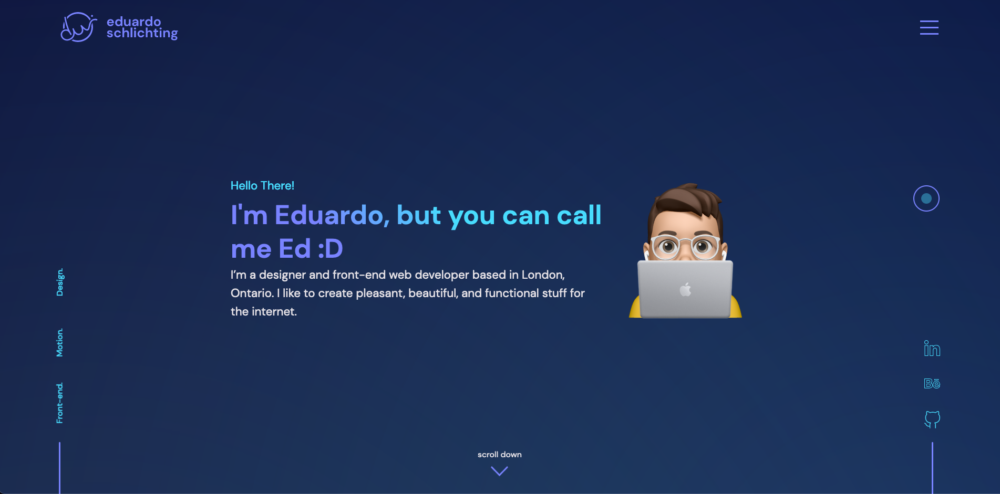

<h1 align="center">
     
</h1>

<h2 align="center">Eduardo Schlichting - Front-end Developer Portfolio</h2>

<p align="center">
    
  
  
  
  
  
</p>

----
<h4 align="center">
  Welcome to my personal front-end web development portfolio! Designed and developed by me from scrath by me with HTML, SASS, JavaScript, VueJs, PHP and MySql.
</h4>

<p align="center">
  <a href="#page_with_curl-about">About</a>&nbsp;&nbsp;&nbsp;|&nbsp;&nbsp;&nbsp;
  <a href="#hammer-technologies">Technologies</a>
  &nbsp;&nbsp;&nbsp;|&nbsp;&nbsp;&nbsp;
  <a href="#books-requirements">Requirements</a>&nbsp;&nbsp;&nbsp;|&nbsp;&nbsp;&nbsp;
  <a href="#rocket-seeing-it-in-action">Seeing it in Action</a>&nbsp;&nbsp;&nbsp;|&nbsp;&nbsp;&nbsp;
  <a href="#memo-license">License</a>
</p>

<h1 align="center">
     
</h1>

## :page_with_curl: About

I'm a brazilian dude currently living in Canada and I'm passionated about fron-end development. I'm also a graphic designer on my free time :D

This personal website contains my best work in front-end, UX/UI and Design throughout the years. It was developed and designed following a mobile-first approach, meaning it is super responsive, and also, uses dynamic data to showcase all my work.

Hope you enjoy it!

## :hammer: Technologies

The project was developed with the following technologies:

Languages:
- HTML
- JavScript
- PHP
- MySql

Tools and Frameworks:
- Vue.js
- SASS
- Gulp
- VsCode


## :memo: License

This project is under the MIT license. 

```
MIT License

Copyright (c) 2021 Eduardo Schlichting

Permission is hereby granted, free of charge, to any person obtaining a copy
of this software and associated documentation files (the "Software"), to deal
in the Software without restriction, including without limitation the rights
to use, copy, modify, merge, publish, distribute, sublicense, and/or sell
copies of the Software, and to permit persons to whom the Software is
furnished to do so, subject to the following conditions:

The above copyright notice and this permission notice shall be included in all
copies or substantial portions of the Software.

THE SOFTWARE IS PROVIDED "AS IS", WITHOUT WARRANTY OF ANY KIND, EXPRESS OR
IMPLIED, INCLUDING BUT NOT LIMITED TO THE WARRANTIES OF MERCHANTABILITY,
FITNESS FOR A PARTICULAR PURPOSE AND NONINFRINGEMENT. IN NO EVENT SHALL THE
AUTHORS OR COPYRIGHT HOLDERS BE LIABLE FOR ANY CLAIM, DAMAGES OR OTHER
LIABILITY, WHETHER IN AN ACTION OF CONTRACT, TORT OR OTHERWISE, ARISING FROM,
OUT OF OR IN CONNECTION WITH THE SOFTWARE OR THE USE OR OTHER DEALINGS IN THE
SOFTWARE.
```

----
Made with ❤️ by Eduardo Schlichting 👋🏻 [Get in touch!](https://github.com/eduardoschlichting)


